#  Isometric 3D Contributions Graphs

Generate beautiful 3D isometric visualizations of GitHub contribution graphs. Available as both a CLI tool and a fast, cached API server.

## Examples

<table>
  <tr>
    <td align="center">
      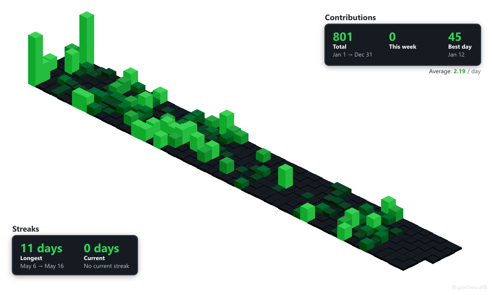<br/>
      <b>GitHub Theme</b>
    </td>
    <td align="center">
      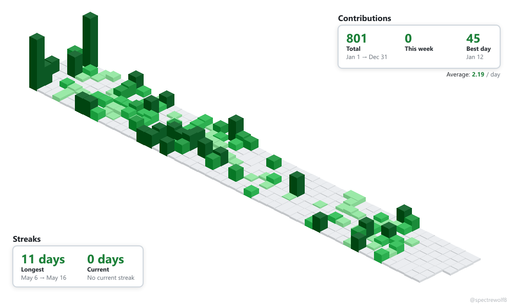<br/>
      <b>Light Theme</b>
    </td>
    <td align="center">
      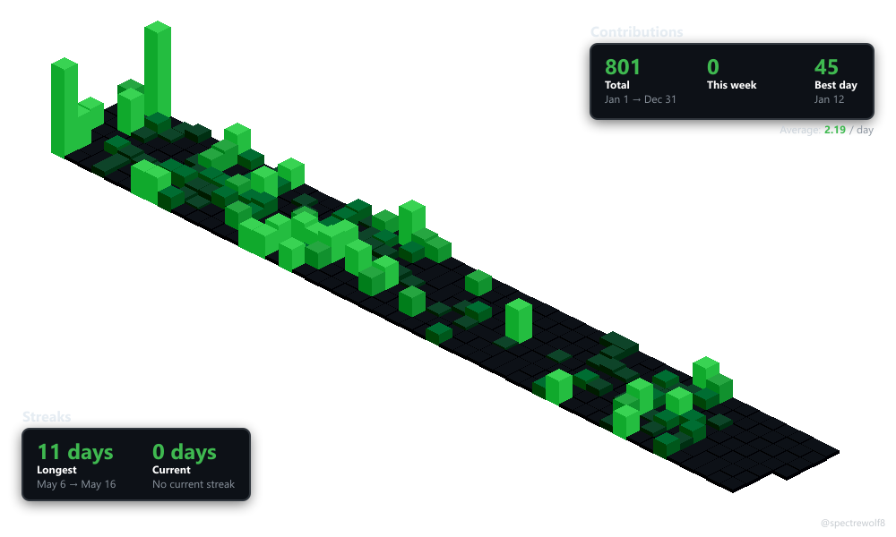<br/>
      <b>Dark Theme</b>
    </td>
  </tr>
  <tr>
    <td align="center">
      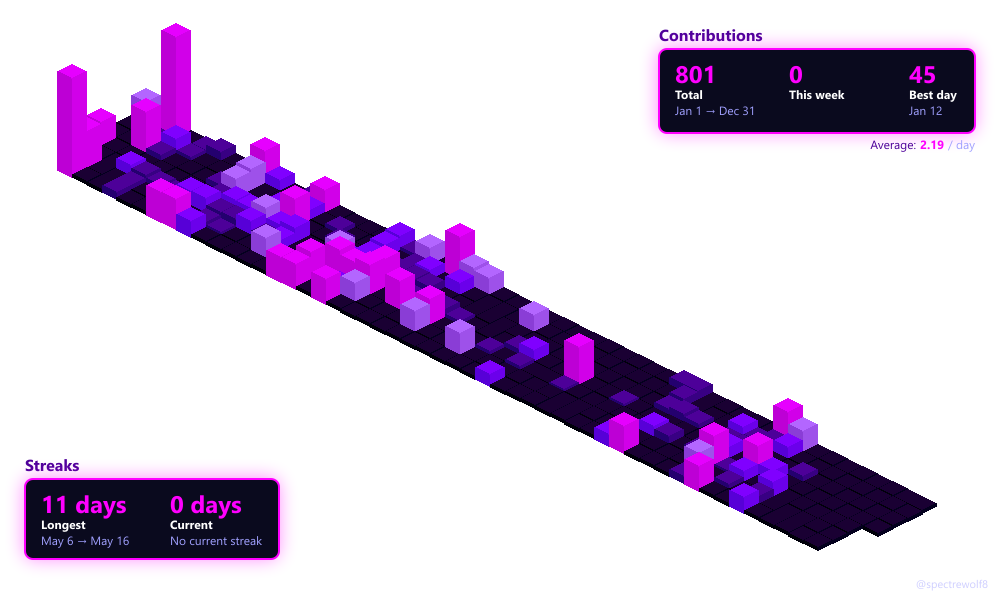<br/>
      <b>Neon Theme</b>
    </td>
    <td align="center">
      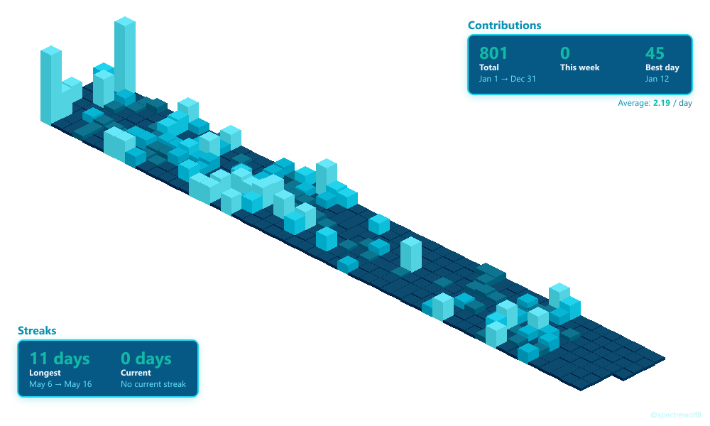<br/>
      <b>Ocean Theme</b>
    </td>
    <td align="center">
      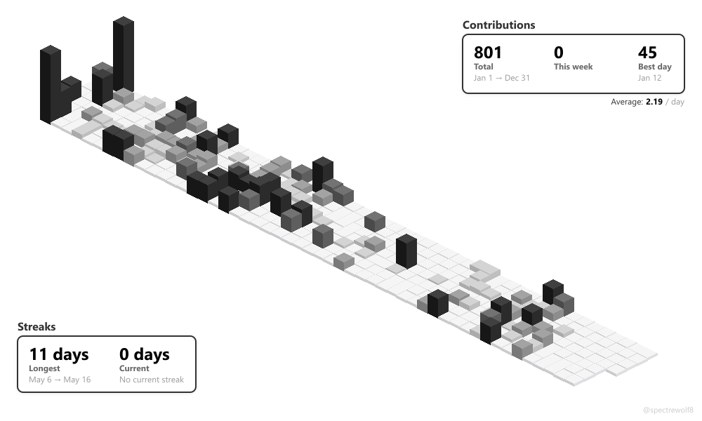<br/>
      <b>Minimal Theme</b>
    </td>
  </tr>
  <tr>
    <td align="center">
      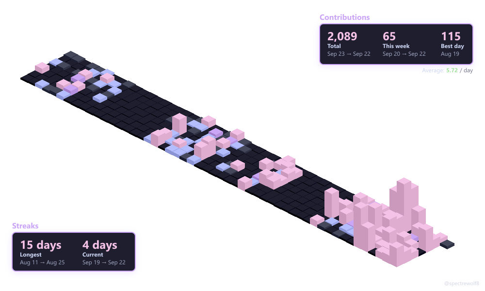<br/>
      <b>Catppuccin Theme</b>
    </td>
    <td align="center">
      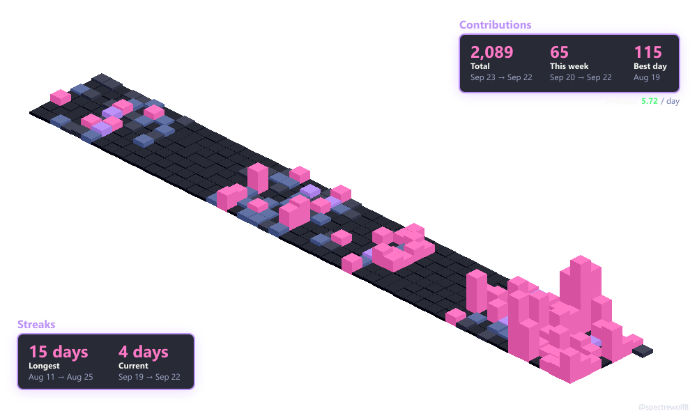<br/>
      <b>Dracula Theme</b>
    </td>
    <td align="center">
      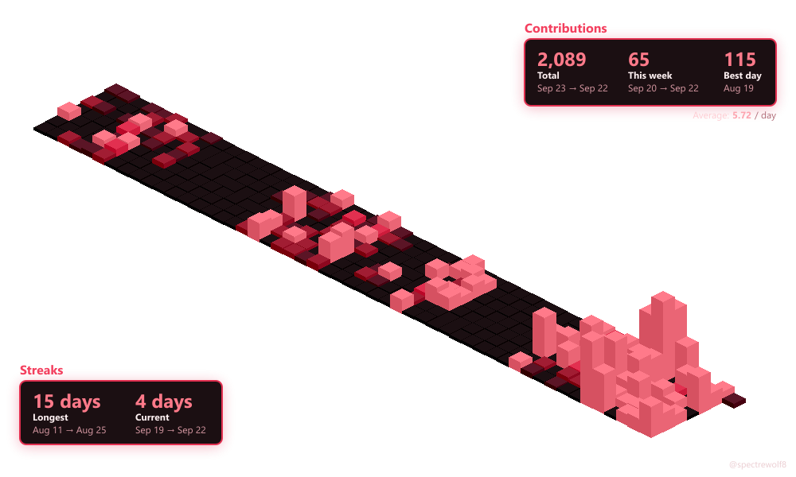<br/>
      <b>Crimson Theme</b>
    </td>
  </tr>
  <tr>
    <td align="center">
      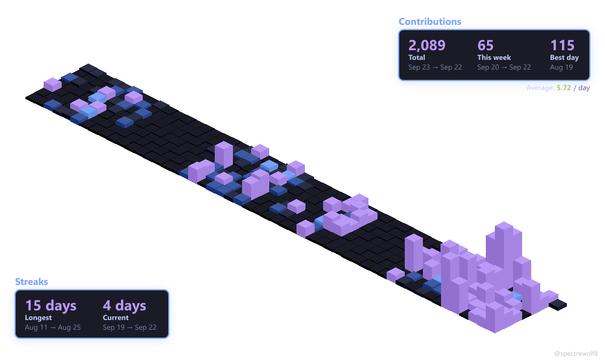<br/>
      <b>Tokyo Night Theme</b>
    </td>
    <td align="center">
      <br/>
      <b>Sunset Theme</b>
    </td>
    <td align="center">
      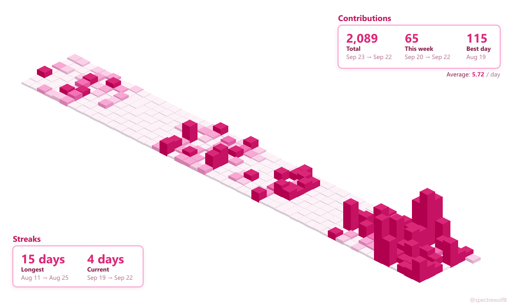<br/>
      <b>Sakura Theme</b>
    </td>
  </tr>
  <tr>
    <td align="center">
      <br/>
      <b>Without Stats</b>
    </td>
    <td align="center">
      <br/>
      <b>Without Credit</b>
    </td>
    <td align="center">
      <br/>
      <b>One Year</b>
    </td>
  </tr>
  <tr>
    <td align="center">
      <br/>
      <b>365-Day Rolling Window (Default)</b>
    </td>
    <td align="center"></td>
    <td align="center"></td>
  </tr>
</table>

## Features

- ⚡ **Fast API** with intelligent caching and revalidation
- 🎨 **12 Built-in Themes**: GitHub, Dark, Light, Neon, Minimal, Ocean, Catppuccin, Dracula, Crimson, Tokyo Night, Sunset, Sakura
- 🖌️ **Custom Themes**: design your own colors via the API or the in-page theme builder
- 📊 **Statistics Overlay**: Contributions, streaks, averages
- 🖼️ **Customizable**: Dimensions, year selection, credits, themes
- 🚀 **Minimal**: Lightweight with no framework overhead
- 💾 **Smart Caching**: Efficient daily caching with instant updates
- 📅 **365-Day Rolling Window**: Default view showing last 365 days of activity

## Installation

```bash
npm install
```

### Environment Variables

Create a `.env` file in the project root:

```env
GITHUB_TOKEN=your_github_personal_access_token
SUPABASE_URL=your_supabase_project_url
SUPABASE_ANON_KEY=your_supabase_anon_key
```

> **`GITHUB_TOKEN`**: A [GitHub personal access token](https://github.com/settings/tokens) is required. No scopes are needed for public contribution data.
>
> **Use a _classic_ token, not a fine-grained one.** Organizations can restrict fine-grained tokens (for example, capping their lifetime). When an organization does, contributions to _its_ repositories, **even public ones**, are silently hidden from graphs for every user who contributes there, while GitHub still reports a self-consistent (smaller) total. Classic tokens aren't subject to these policies. The server prints a startup warning if it detects a fine-grained token.

## Quick Start

### CLI Usage

Generate an isometric contribution graph:

```bash
npm run generate -- <username> [year] [output] [options]
```

**Examples:**

```bash
# Basic usage
npm run generate -- spectrewolf8

# Specific year with stats
npm run generate -- spectrewolf8 2025 graph.png --stats --credit

# Custom dimensions
npm run generate -- spectrewolf8 2025 graph.png --width 1920 --height 1080
```

**CLI Options:**

- `--stats` - Include statistics overlay
- `--credit` - Show username in bottom right
- `--width <px>` - Canvas width (default: 1000)
- `--height <px>` - Canvas height (default: 600)

### API Server

Start the API server for web integration:

```bash
npm run server
```

Or with auto-reload during development:

```bash
npm run dev
```

Server runs on port 3000 (configurable via `PORT` environment variable).

## API Documentation

### Endpoint

```
GET /api/graph
```

### Query Parameters

| Parameter  | Type          | Required | Default           | Description                                                                     |
| ---------- | ------------- | -------- | ----------------- | ------------------------------------------------------------------------------- |
| `username` | string        | ✅ Yes   | -                 | GitHub username                                                                 |
| `year`/`y` | number/string | No       | `none` (365 days) | Year to fetch (e.g., `2025`), or `none` for 365-day rolling window ending today |
| `theme`    | string        | No       | `github`          | Visual theme: `github`, `dark`, `light`, `neon`, `minimal`, `ocean`, `catppuccin`, `dracula`, `crimson`, `tokyonight`, `sunset`, `sakura`, or `custom` (see [Custom Themes](#custom-themes)) |
| `colors`   | string        | No       | -                 | Custom mode only. Five comma-separated hex colors for the cube levels 0 to 4, e.g. `colors=161b22,0e4429,006d32,26a641,39d353` (leading `#` optional) |
| `bg`       | string        | No       | -                 | Custom mode only. Hex background for the stats box (applies only with `stats=true`)             |
| `border`   | string        | No       | -                 | Custom mode only. Hex border for the stats box (applies only with `stats=true`)                 |
| `accent`   | string        | No       | -                 | Custom mode only. Hex accent for the stats title/value text (applies only with `stats=true`)    |
| `width`    | number        | No       | `1000`            | Image width in pixels                                                           |
| `height`   | number        | No       | `600`             | Image height in pixels                                                          |
| `stats`    | boolean       | No       | `false`           | Include statistics overlay                                                      |
| `credit`   | boolean       | No       | `false`           | Show username credit                                                            |

### API Examples

**Basic Graph:**

```
https://isometric-contributions-spectrewolf8.onrender.com/api/graph?username=spectrewolf8
```

**With Statistics:**

```
https://isometric-contributions-spectrewolf8.onrender.com/api/graph?username=spectrewolf8&stats=true
```

**365-Day Rolling Window (Default):**

```
https://isometric-contributions-spectrewolf8.onrender.com/api/graph?username=spectrewolf8
```

**Specific Year:**

```
https://isometric-contributions-spectrewolf8.onrender.com/api/graph?username=spectrewolf8&year=2025
```

**With Theme:**

```
https://isometric-contributions-spectrewolf8.onrender.com/api/graph?username=spectrewolf8&theme=dark&stats=true
```

**With Credit:**

```
https://isometric-contributions-spectrewolf8.onrender.com/api/graph?username=spectrewolf8&credit=true
```

**Full Customization:**

```
https://isometric-contributions-spectrewolf8.onrender.com/api/graph?username=spectrewolf8&year=2025&width=1200&height=700&stats=true&credit=true&theme=neon
```

> **Note:** Use `http://localhost:3000` for local testing.

### Custom Themes

Beyond the built-in themes, you can design your own. Set `theme=custom` and pass five hex colors for the contribution levels (0 to 4, low to high):

```
https://isometric-contributions-spectrewolf8.onrender.com/api/graph?username=spectrewolf8&theme=custom&colors=0d1117,3a1078,4e31aa,3795bd,aad7d9
```

The stats box can be styled too, but only when the overlay is on (`stats=true`): `bg` sets the box background, `border` the box border, and `accent` the title/value text. Anything you leave out is derived automatically (text color is chosen for legibility against `bg`):

```
https://isometric-contributions-spectrewolf8.onrender.com/api/graph?username=spectrewolf8&theme=custom&colors=0d1117,3a1078,4e31aa,3795bd,aad7d9&bg=0d1117&border=aad7d9&accent=aad7d9&stats=true
```

The easiest way to build one is the **URL and Theme Builder** on the [live docs page](https://isometric-contributions-spectrewolf8.onrender.com/): pick <b>Custom</b> in the theme dropdown, choose your colors with the pickers (or paste hex values), and copy the generated URL.

### Caching

The API implements intelligent daily caching:

- **Cache Strategy**: One generation per username+params per day, stored server-side in Supabase
- **No client-side caching**: responses are sent with `Cache-Control: no-store`, so browsers and GitHub's image proxy always fetch a fresh image, so a README graph never shows stale data
- **Cache Headers**: Check `X-Cache` header (`HIT` or `MISS`) to see whether the server-side cache was used
- **Benefits**: Instant responses for repeated requests, without the client ever holding an outdated image

**Cache Response Headers:**

```
Content-Type: image/png
Content-Length: <bytes>
Cache-Control: no-store, no-cache, must-revalidate, max-age=0
Pragma: no-cache
Expires: 0
X-Cache: HIT | MISS
```

### Additional Endpoints

**Documentation:**

```
GET /
GET /docs
```

**Health Check:**

```
GET /health
```

**Contribution Summary:**

```
GET /api/status?username=<username>
```

Reports what GitHub counts for a user over the default 365-day window (the same number the graph is built from), split into public contributions and private contributions counted anonymously:

```json
{
  "username": "octocat",
  "from": "2025-09-23",
  "to": "2026-09-22",
  "total_contributions": 2087,
  "public_contributions": 1702,
  "private_contributions": 385,
  "note": "2,087 contributions counted from 2025-09-23 to 2026-09-22. 385 of them are private contributions, counted anonymously ..."
}
```

## Data Accuracy & Limitations

Graphs are built from GitHub's official GraphQL API, and the total is the same number GitHub shows on your **public profile** ("N contributions in the last year"). In particular:

- **Private contributions are included if you display them.** GitHub's profile setting _Contribution settings > Private contributions_ shows your private activity publicly, anonymized (green squares, no repo names). When it's on, those contributions are counted for every viewer, the graph included. When it's off, they're hidden from the public profile _and_ from the graph alike. Either way the graph matches what the public sees.
- **The one thing that makes the graph lower than your profile is an organization's token policy.** An organization can restrict personal access tokens (for example, capping fine-grained token lifetimes). When it does, GitHub hides that organization's repositories, **even public ones**, from the service's token, and every contribution to them silently drops out of the graph while GitHub still reports a self-consistent (smaller) total. Nothing in the API flags this, so the service can't detect it; it can only tell you the possibility exists.

`GET /api/status?username=...` (and the **Check my graph** tool on the docs page) shows exactly what's being counted for you: the total for the window, split into public and private-counted-anonymously. If that total matches your profile, the graph is complete.

**If you run the server:** use a **classic** token. See the `GITHUB_TOKEN` note under [Environment Variables](#environment-variables): classic tokens aren't subject to per-organization fine-grained-token policies, which removes the only common cause of an under-count. The server warns at startup if it detects a fine-grained token.

## Programmatic Usage

### Fetch Contributions

```javascript
import {
  fetchContributions,
  parseContributionsData,
} from "./src/api-client.js";

const data = await fetchContributions("username", 2025);
const days = parseContributionsData(data);
```

### Render Image

```javascript
import { renderIsometricChart, exportToPNG, setTheme } from "./src/renderer.js";
import { DARK_THEME } from "./src/theme-config.js";
import { writeFileSync } from "fs";

// Set theme (optional)
setTheme(DARK_THEME);

// Render
const canvas = renderIsometricChart(days, {
  width: 1000,
  height: 600,
  username: "spectrewolf8", // optional credit
});

// Export
const buffer = await exportToPNG(canvas);
writeFileSync("output.png", buffer);
```

### With Statistics

```javascript
import { renderWithStats } from "./src/renderer.js";

const canvas = renderWithStats(days, {
  width: 1000,
  height: 600,
});
```

### Available Themes

```javascript
import {
  GITHUB_THEME,
  DARK_THEME,
  LIGHT_THEME,
  NEON_THEME,
  MINIMAL_THEME,
  OCEAN_THEME,
  CATPPUCCIN_THEME,
  DRACULA_THEME,
  CRIMSON_THEME,
  TOKYONIGHT_THEME,
  SUNSET_THEME,
  SAKURA_THEME,
  buildCustomTheme,
} from "./src/theme-config.js";
import { setTheme } from "./src/renderer.js";

// Apply a built-in theme before rendering
setTheme(NEON_THEME);

// Or build your own from a 5-color ramp (level 0 to 4)
setTheme(
  buildCustomTheme({
    colors: ["#0d1117", "#3a1078", "#4e31aa", "#3795bd", "#aad7d9"],
    bg: "#0d1117",
    border: "#aad7d9",
    accent: "#aad7d9",
  }),
);
```

## Embedding in README

### Markdown

```markdown

```

**With theme:**

```markdown

```

### HTML

```html

```

## Scripts

| Command                     | Description                       |
| --------------------------- | --------------------------------- |
| `npm run generate`          | Generate graph via CLI            |
| `npm run server`            | Start API server                  |
| `npm run dev`               | Start server with auto-reload     |
| `npm run test:api`          | Test API endpoints                |
| `npm run cleanup`           | Manually run cache cleanup        |
| `npm run cleanup:scheduler` | Start automatic cleanup scheduler |

## Output

Generates PNG images with:

- **Resolution**: Customizable (default 1000x600)
- **Format**: PNG with transparency
- **Size**: ~20-30 KB (varies with dimensions)

### Statistics Displayed

- Total contributions
- Best day (max contributions)
- Average per day
- Longest streak
- Current streak

## Cache Management

The project includes automatic cache cleanup to remove old files from Supabase Storage.

### Setup

1. **Add environment variables to `.env`:**

   ```env
   SUPABASE_ANON_KEY=your-anon-key
   CACHE_RETENTION_DAYS=1
   CLEANUP_SCHEDULE=0 3 * * *  # Daily at 3 AM
   RUN_ON_STARTUP=true
   TZ=UTC
   ```

2. **Add DELETE policy to Supabase (one-time setup):**

   Run this in your Supabase SQL Editor:

   ```sql
   CREATE POLICY "Anon delete access"
     ON storage.objects
     FOR DELETE
     TO anon
     USING (bucket_id = 'isometric-cache');

   GRANT DELETE ON storage.objects TO anon;
   ```

3. **Start the scheduler:**
   ```bash
   npm run cleanup:scheduler
   ```

The scheduler runs automatically in Docker/production (see [Dockerfile](Dockerfile)).

### Manual Cleanup

Run cleanup on-demand:

```bash
npm run cleanup
```

### Cron Schedule Examples

- `0 3 * * *` - Daily at 3 AM
- `0 */6 * * *` - Every 6 hours
- `0 */12 * * *` - Every 12 hours
- `*/30 * * * *` - Every 30 minutes
- `0 0 * * 0` - Weekly on Sunday at midnight

### How It Works

The cleanup script:

1. Lists all files in the Supabase Storage bucket
2. Checks each file against retention criteria:
   - Files with `created_at` older than retention period
   - Files in date folders (e.g., `username/2026-02-01/`) older than retention
   - `.emptyFolderPlaceholder` files
3. Deletes matching files using Supabase Storage API
4. Logs results with counts and examples

### Production Deployment

**Docker/Render/Railway:**

The Dockerfile automatically starts both processes:

```dockerfile
CMD ["sh", "-c", "node server.js & node cleanup-scheduler.js & wait"]
```

Just add the environment variables to your hosting platform.

## Troubleshooting

### Graph looks sparse / total is lower than my profile

Almost always one of these. Check `GET /api/status?username=<you>` first; if its total matches your profile, the graph is complete:

- **Your private contributions aren't displayed.** If _Contribution settings > Private contributions_ is off on your profile, private activity is hidden from your public profile and from the graph alike, so the graph matches what visitors see, even if it's less than what you see when logged in. Turn the setting on to include them (anonymized). See [Data Accuracy & Limitations](#data-accuracy--limitations).
- **An organization you contribute to restricts token access** (e.g. it caps fine-grained token lifetimes). That hides _its_ repos, even public ones, from the server's token, and those contributions drop out of the graph. If you run the server, switch to a **classic** token; the server warns at startup if it detects a fine-grained one.
- **Commits weren't attributed to you.** The commit author email must be linked to your GitHub account, the commits must be on the default (or `gh-pages`) branch, and the repository must not be a fork. See GitHub's [why are my contributions not showing up](https://docs.github.com/en/account-and-profile/setting-up-and-managing-your-github-profile/managing-contribution-settings-on-your-profile/why-are-my-contributions-not-showing-up-on-my-profile).

### Cache Cleanup Issues

**No files deleted:**

- Check `CACHE_RETENTION_DAYS` - files must be older than this
- Verify DELETE policy is set up in Supabase (see setup step 2)
- Check file dates in Supabase dashboard

**Permission errors:**

- Ensure DELETE policy exists for anon role on storage.objects
- Run the setup SQL in Supabase SQL Editor (see Cache Management section)
- Verify bucket name matches `SUPABASE_BUCKET_NAME`

**Scheduler not running:**

- Verify cron expression is valid
- Check timezone setting (`TZ` environment variable)
- Ensure process stays running (use PM2 or Docker)
- Check logs: `pm2 logs cache-cleanup` (if using PM2)

**Manual testing:**

```bash
# Test cleanup manually
npm run cleanup

# With different retention
CACHE_RETENTION_DAYS=7 npm run cleanup
```

**Check cleanup logs:**

The cleanup script outputs logs:

```
🧹 Cleaning cache (retention: 1 day(s))
📅 Deleting folders older than 2026-02-02
✅ No old folders to delete

✨ Cleanup completed
```

## Acknowledgements

This project builds upon the excellent work of:

- **Core Renderer**: Based on [isometric-contributions](https://github.com/jasonlong/isometric-contributions) by Jason Long - the foundational isometric rendering logic was taken and modified for this implementation
- **GitHub GraphQL API**: Contribution data is fetched directly from GitHub's official GraphQL API using a personal access token — no third-party services required

## Contributing

Feel free to open issues or submit PRs for improvements!

## License

This project is licensed under the [MIT License](http://opensource.org/licenses/MIT).
